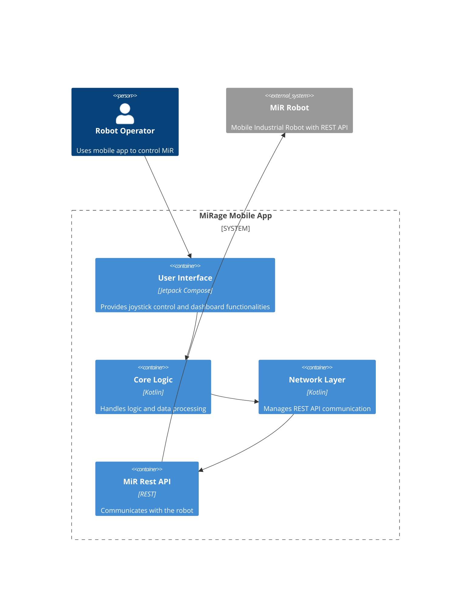
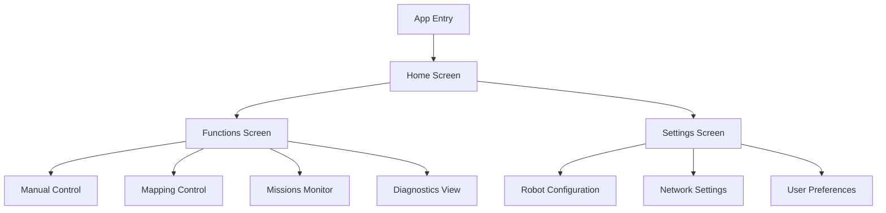

# MiRage Docs

## Context

MiRage is a mobile application designed to control and monitor Mobile Industrial Robots (MiR). The app provides a user-friendly interface for robot control, status monitoring, and configuration management.

## Container

## Components

### Navigation Structure

### Core Components

| **Component** | **Responsibility** | **Technology** |
| --- | --- | --- |
| Navigation | Screen navigation and routing | Jetpack Navigation |
| HomeView | Main dashboard and status overview | Jetpack Compose |
| FunctionsView | Robot control and monitoring functions | Jetpack Compose |
| SettingsView | Application and robot configuration | Jetpack Compose |

## Functions

### Authentication & Setup

- WiFi Connection Management
    - Scan and display available networks
    - Connect to robot's WiFi network
    - Handle connection status and errors
- User Authentication
    - Login with credentials
    - Basic token storage
    - Session management

### Robot Control

- Movement Control
    - Virtual joystick interface
    - WebSocket secure connection
    - Real-time command transmission
- Status Monitoring
    - Robot state display in TopAppBar
    - Connection status indicators
    - Battery level monitoring

### Navigation & Mapping

- Map Visualization
    - Real-time map rendering
    - Obstacle detection display
    - Path visualization
- Path Planning
    - Interactive map editing
    - Custom path creation
    - Waypoint management

### Mission Control

- Mission Management
    - Create and edit missions
    - Mission sequence planning
    - Block-based programming interface
- Mission Execution
    - Start/stop missions
    - Real-time progress tracking
    - Error handling

### System Monitoring

- Logging System
    - System logs viewing
    - Error log management
    - Mission execution logs
- Hardware Monitoring
    - Component status tracking
    - Diagnostic information
    - Performance metrics

### Settings & Configuration

- App Settings
    - Theme customization
    - Language preferences
    - Advanced mode toggle
- Robot Configuration
    - Movement parameters
    - Sensor calibration
    - Network settings

### Additional Features

- Sound Management
    - Custom sound uploads
    - Sound playback control
    - Audio feedback settings
- Analytics
    - Usage statistics
    - Performance tracking
    - System health analytics

## Interface Components

- Navigation
    - Bottom Navigation Bar
    - Top AppBar with status
    - Sidebar menu
- Common UI Elements
    - Loading indicators
    - Error messages
    - Confirmation dialogs

## Dependencies

- UI → Jetpack Compose (Material3)
- API Calls → Ktor
